# 🍔 FoodHub - Online Food Delivery System

Welcome to **FoodHub**, a modern, full-stack web application designed for seamless online food ordering. Built with Python, Flask, and SQLite on the backend, and powered by responsive HTML5, CSS3, JavaScript, and Bootstrap 5 on the frontend. 

FoodHub aims to provide a premium user experience for customers to browse menus, manage their carts, place orders, and track their history, while giving administrators powerful tools to manage the catalog and moderate user reviews.

---

## 📚 Academic Information
- **Subject Code:** PRP230807
- **Subject Name:** Programming in Python
- **Topic:** Online Food Delivery System

## 👥 Team Members
- **B002** (Rudra Babar)
- **B010** (Aryan Desale)
- **B030** (Shishir Bhavsar)

---

## ✨ Core Features

### For Customers (Users)
- **Secure Authentication:** User registration, login, and robust session-based access control with password hashing (`Werkzeug.security`).
- **Smart Menu Browsing:** Dynamic menu with advanced search functionality, category filtering, veg/non-veg toggles, and price range sorting.
- **Shopping Cart Management:** Interactive sliding cart to add items, update quantities, remove items, and view price calculations in real-time.
- **Seamless Checkout:** A clean checkout workflow capturing delivery addresses, contact numbers, and providing the ability to save addresses for future use.
- **Order History & Tracking:** Users can view their past orders, check fulfillment statuses, and see detailed item breakdowns.
- **Review System:** Customers can rate their overall experience and leave specific feedback/comments on individual food items.

### For Administrators
- **Admin Dashboard:** A dedicated, secure interface for managing the entire platform operations.
- **Menu Management:** Perform full CRUD operations (Create, Read, Update, Delete) on food items. Upload images, set prices, and categorize dishes dynamically.
- **Review Moderation:** Approve or reject customer reviews to ensure quality control and maintain high platform standards.

---

## 📸 Visual Walkthrough

Here is a visual tour of the application's core interfaces and user workflows.

### 1. Authentication
*Users can create accounts and securely log into the system.*
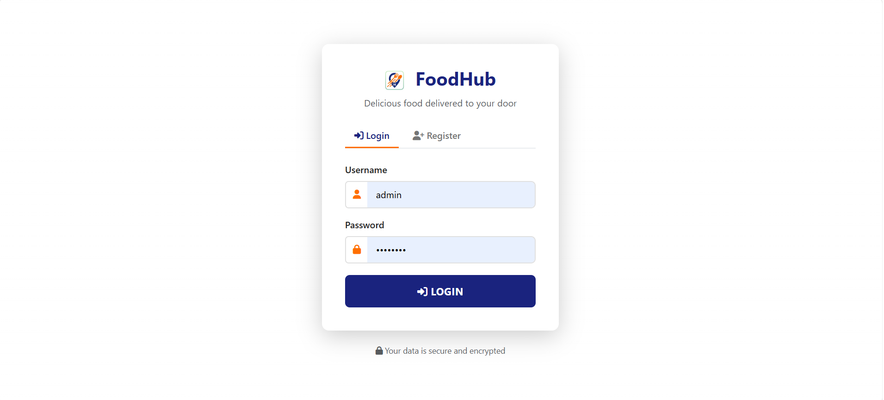 

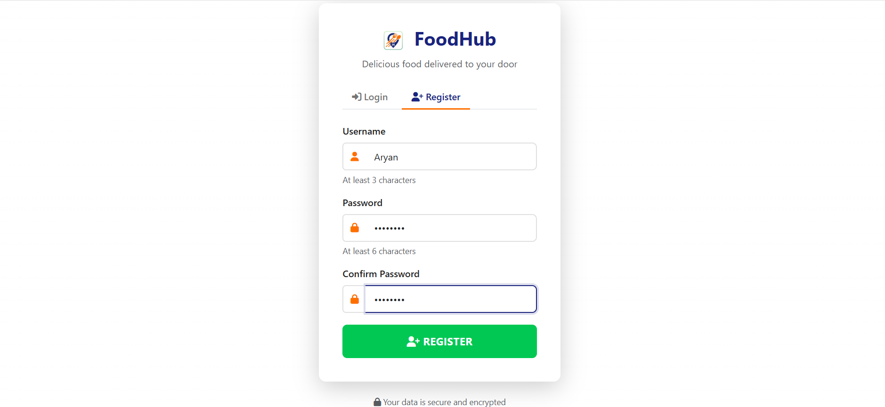


### 2. Menu & Browsing
*Customers can browse a variety of delicious items, filter by Veg/Non-Veg, and search for specific cravings.*
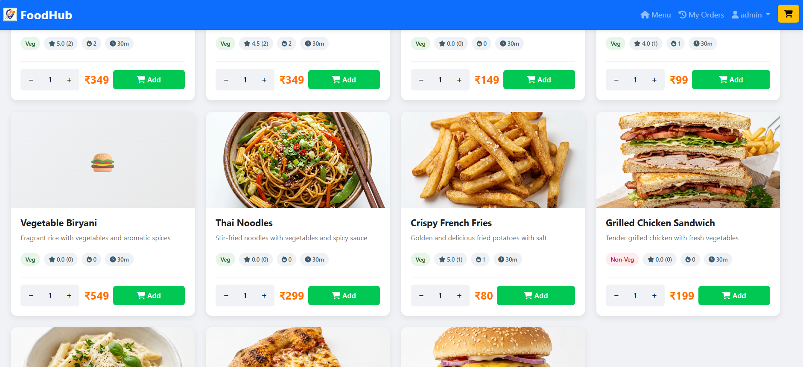
*Browsing the expansive food menu with rich item cards.*


*Using advanced search and category filters to find the perfect meal.*

### 3. Shopping Cart
*An interactive sliding cart lets users manage their selected items before proceeding to checkout.*
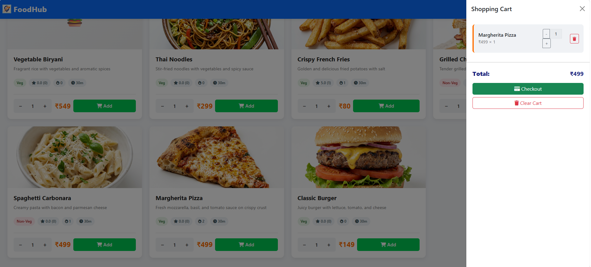

### 4. Checkout Process
*A clean and intuitive checkout page where users can input delivery details, use saved addresses, or fetch their current location.*
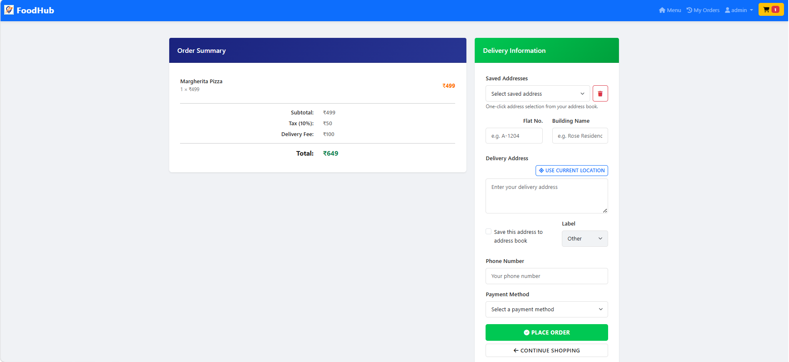
*Entering delivery information and reviewing the order summary.*

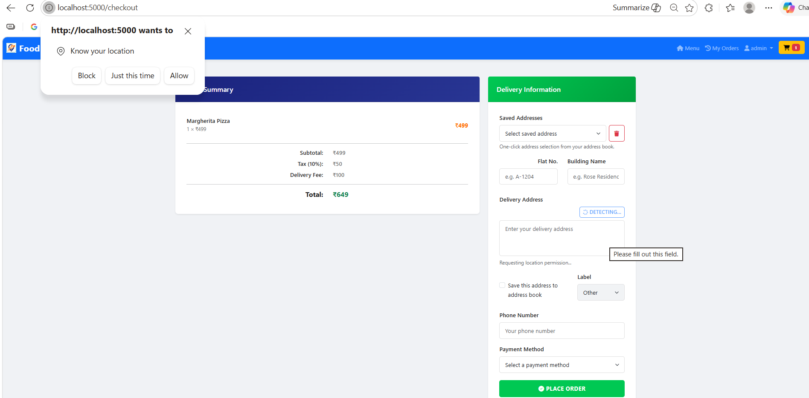
*Browser prompt integration for current location.*

### 5. Order Confirmation & History
*Users get instant feedback upon placing an order and can view all past activities.*
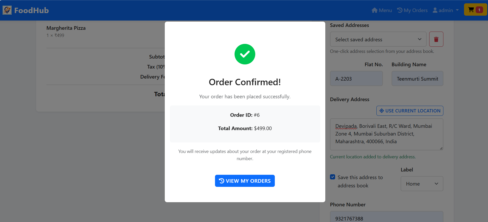
*Order successfully placed popup.*

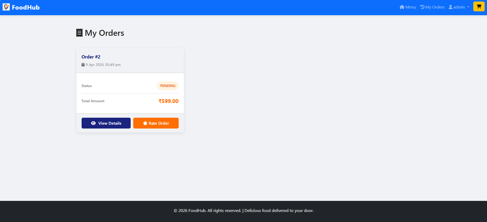
*Viewing past orders and current statuses on the History page.*

### 6. Ratings & Reviews
*Customers can review their prior orders to help the community.*
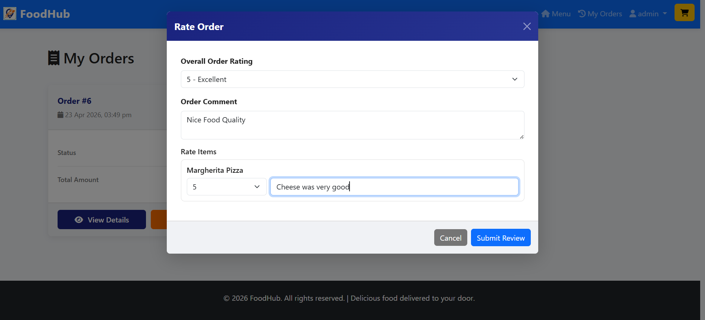
*Leaving a star rating and comment for ordered food.*

### 7. Administrator Panel
*Administrators have full administrative control over the catalog and incoming reviews.*
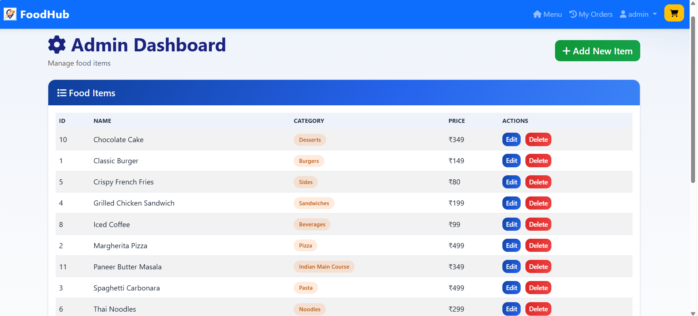
*Admin view for tracking and managing all food items on the platform.*

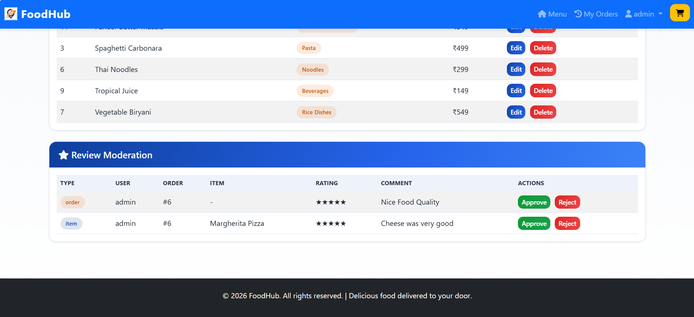
*Moderating incoming user reviews (Approve/Reject).*

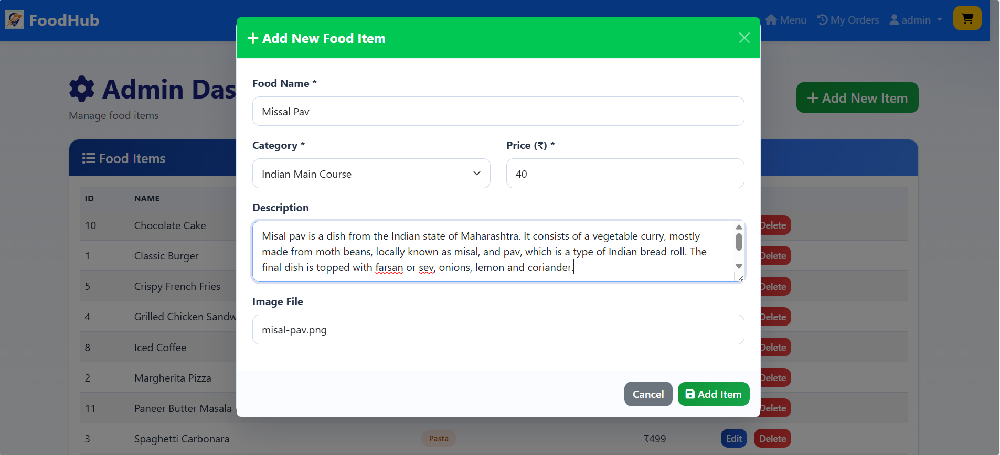
*Adding a new food item to the live database.*

---

## 🎥 Project Demo Video

Because visualizing the flow is important, please view the complete application walkthrough video below:

[▶️ Click here to view Project Demo Video](docs/video/demo.mp4)

---

## 🛠️ Technology Stack

**Backend Architecture:**
- **Python 3.x:** Core server-side programming language.
- **Flask:** Lightweight, highly flexible WSGI web application framework.
- **Werkzeug:** Utility library handling request parsing and robust password hashing algorithms.
- **SQLite3:** Relational database management system chosen for lightweight, file-based data storage and easy setup.

**Frontend Interface:**
- **HTML5:** Semantic document structure.
- **CSS3:** Custom styling implementing a premium, modern aesthetic with careful color theory.
- **JavaScript (Vanilla):** Dynamic DOM manipulation, modal handling, and asynchronous API calls (AJAX/Fetch).
- **Bootstrap 5:** Utility-first CSS framework facilitating rapid, mobile-first responsive design.

---

## 📁 Project Structure

```text
.
├── app.py                # Main Flask application and route definitions
├── config.py             # Configuration constants and UI theme variables
├── setup_db.py           # Database initialization and seeding script
├── schema.sql            # SQLite database schema definitions
├── requirements.txt      # Python package dependencies
├── static/               # Static assets (CSS, JS, Fonts, App Images)
├── templates/            # Jinja2 HTML templates
├── screenshots/          # Application screenshots for documentation
└── docs/                 # Detailed documentation and videos
```

---

## 🚀 Setup and Installation

Follow these instructions to run the project locally on your machine.

**1. Clone the repository**
```bash
git clone https://github.com/your-username/your-repo.git
cd py-project
```

**2. Set up a virtual environment (Recommended)**
Isolating dependencies ensures no conflicts with system packages.
```bash
python -m venv .venv
# On macOS/Linux:
source .venv/bin/activate
# On Windows:
.venv\Scripts\activate
```

**3. Install dependencies**
```bash
pip install -r requirements.txt
```

**4. Initialize the database**
This script will recreate `food_ordering.db` and insert initial data schemas along with a default admin account.
```bash
python setup_db.py
```

**5. Start the Flask server**
```bash
python app.py
```

**6. Access the application**
Open your preferred modern web browser and navigate to:
```text
http://127.0.0.1:5000
```

---

## ⚠️ Important Deployment Notes
- **Admin Access:** The default admin credentials generated by `setup_db.py` are Username: `admin`, Password: `admin123`.
- **Environment Safety:** Keep `.env` files, `.venv`, and `food_ordering.db` outside of version control (as configured in `.gitignore`).
- **Production Mode:** Before deploying to a live web server (like PythonAnywhere, Heroku, or AWS), edit `app.py` or use environment variables to change the `app.secret_key` to a strong, randomized cryptographic string.

---

